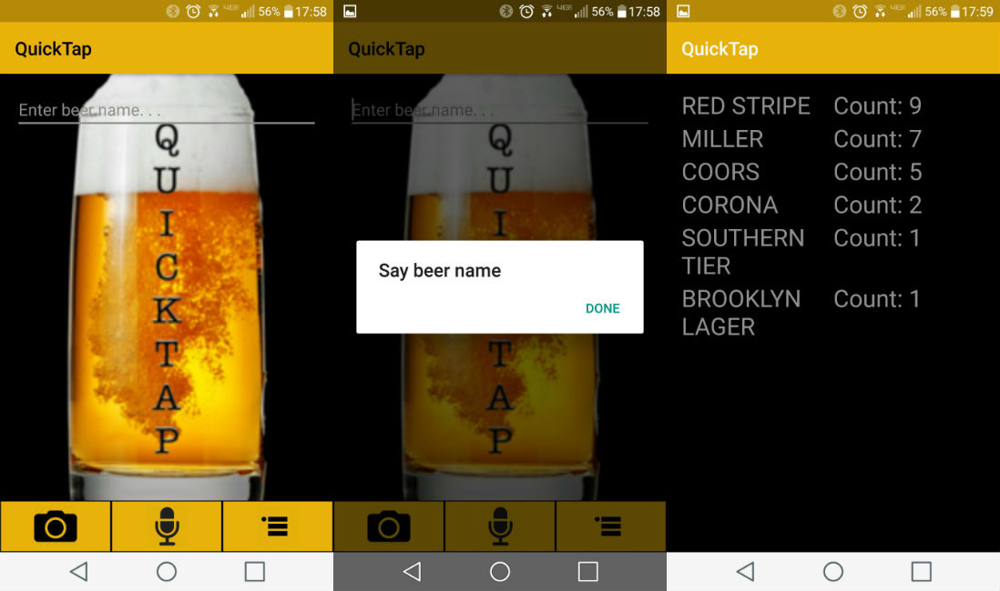

# QuickTap
## 2nd Place at the GA-HPE Haven OnDemand Hackathon
### Overview:
QuickTap was awarded 2nd Place at the GA & [HPE Haven OnDemand](https://community.havenondemand.com/t5/Blog/GA-HPE-Haven-OnDemand-Hackathon-an-Android-Hackathon/ba-p/2654) Hackathon. It was a team effort consisting of partner programming resulting in strong usage of Git branching and merging. The function of the QuickTap is to simplify the task of ordering beers at a bar. The app features the use of HPE's speech recognition API to search for beer related information on BreweryDB. Additionally, the app has its own SQLite database allowing you to store said data for future use.

## Screenshots:
 
